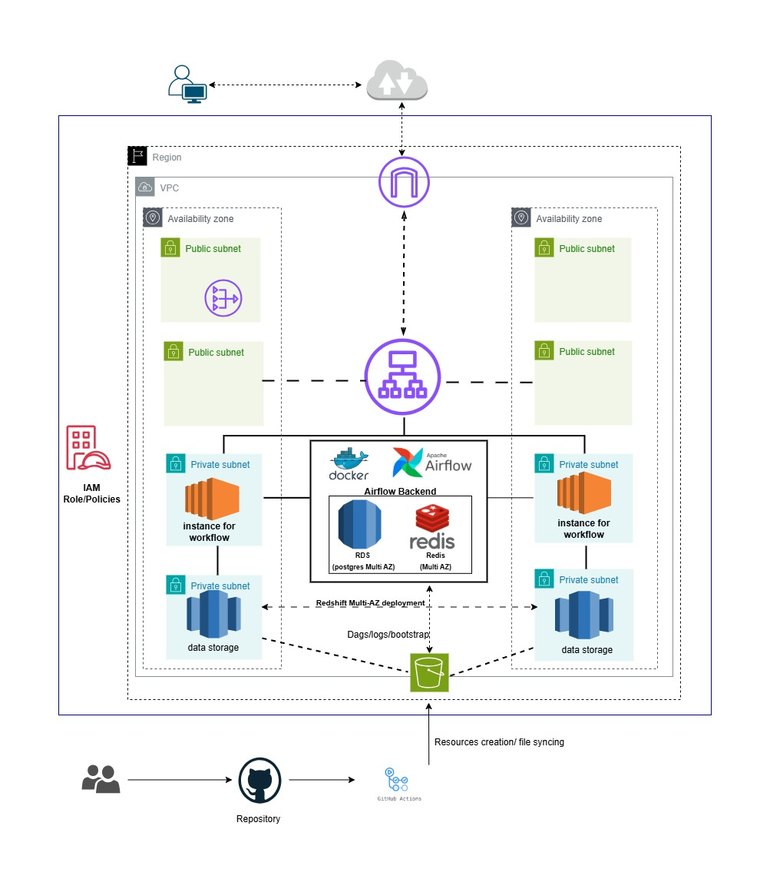
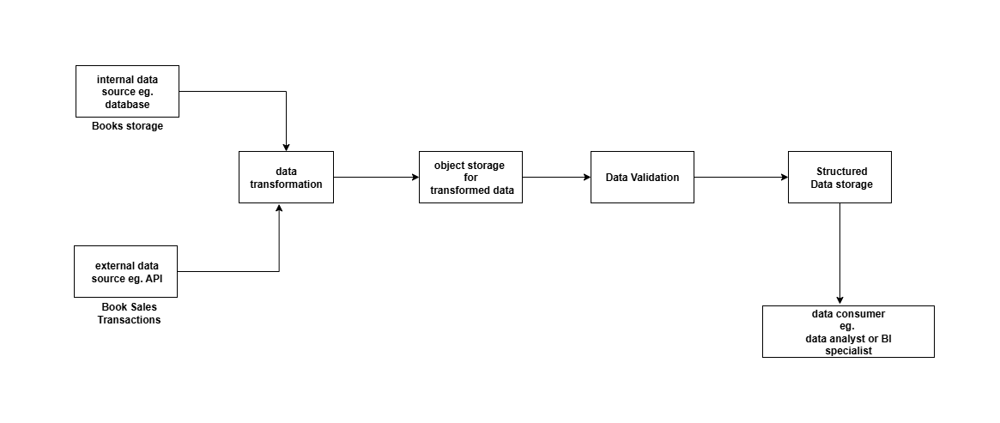

# BeejanTech Analytics Platform

## Introduction

BeejanTech Analytics Platform is a cloud-native data engineering solution that ingests, validates, and loads large datasets into a data warehouse for downstream analytics, using Terraform for infra, Airflow for orchestration, and AWS (S3 + Redshift) for storage and analytics.

## Problem statement

As Beejan Technologies grows, the business needs a scalable, secure, and production-grade data platform to ingest data from internal and external sources, transform and validate it, and store it reliably for analytics and BI. The platform must be provisioned and maintained as code (Terraform), be secure (network isolation and least-privilege access), and support automated deployments (CI/CD).

Primary requirements:
- Reliable data ingestion and transformation
- Secure and scalable storage for structured data
- Orchestration of workflows and retries
- Infrastructure as code with Terraform
- Operational readiness: monitoring, testing, and CI/CD

## Architecture

------
## ETL Overview

## Codebase structure

Top-level layout (important files/folders):

- `orchestration/` — Airflow DAGs and ETL code
  - `dags/` — DAG definitions (Airflow)
  - `etl/` — ETL helper scripts (book generation, upload, file-from-s3, validation)
  - `config/` — SQL helpers and shared configuration
  - `data_validation/` — validation logic for Books and Transactions
  - `Redshift_script/` — SQL scripts for stage & merge
- `bootstrap_scripts/` — helper shell scripts for local install and startup
- `terraform/` — Terraform code (split into `bucket_infra/` and `main_infra/`)
- `tests/` — unit and integration-style tests for DAGs

## My solution

- Orchestration: Airflow DAGs manage the generate → upload → validate → load flow. DAGs are placed under `orchestration/dags/` and import helper code from `orchestration/etl/` and `orchestration/config/`.
- Validation: `orchestration/dags/data_validation` modules check schema and business rules before files are promoted to staging. Failing validations prevent downstream loads.
- Storage/load: Files are staged in S3 and loaded into Redshift using SQL merge scripts in `orchestration/Redshift_script/`.
- Infrastructure: Terraform scripts under `terraform/` are templates for provisioning S3 buckets `bucket_infra/`,  while `main_infra/` provision EC2 and other resources.
- Instance User_data: `bootstrap_scripts/` contains bash scripts for instance user_date to setup ec2 on instances
- *secret.py*: Generate fernet and jwt key for airflow
- .github/workflow: 
  - cd_dag.yaml uploads Airflow DAGs to an S3 bucket on pushes to main (when orchestration/dags/** changes) and uses SSM to sync the DAGs to EC2 Airflow hosts, restart Airflow, and verify deployment.
  - cd.yaml.ci.yaml runs CI checks (e.g., linting, tests, and infrastructure validation like terraform validate/plan) to ensure code quality and infra correctness before deployments.

## Choice of tools 

- AWS S3 — scalable, durable object storage for raw and staged files; inexpensive and integrates well with Redshift COPY.
- Amazon Redshift — purpose-built data warehouse for structured analytics and SQL-based BI. Redshift's COPY command works well with S3-staged files.
- Apache Airflow — mature orchestration platform that provides scheduling, retries, dependency management, and strong community support.
- Terraform — infrastructure-as-code tool to manage cloud resources reproducibly. Terraform modules can be versioned and applied in CI.
- Docker & Docker Compose — reproducible development for Airflow and related services.
- Pytest — testing framework for unit tests and import tests to ensure DAGs load cleanly in CI.
